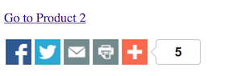
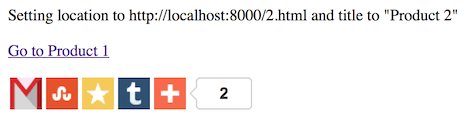

Pjax / Addthis integration experiment
=====================================

To run on localhost:

    python -m SimpleHTTPServer
    open http://localhost:8000/1.html

The start page is 1.html. If you decide to do a full page refresh to
start over again, make sure to navigate back to 1.html.

When you navigate, it opens 2body.html (a page with only a body).
Navigate back to product 1 and you will see 1body.html (another page
with only a body).

Navigation happens with pjax, replacing the body with the contents of
the response.

This is a simulation of a real app, which decides server-side whether to
render the whole page or just the body contents, depending on whether it
is a pjax request.

Addthis problems
----------------

1. If you go to 1.html, then click on Product 2, then hit the Back
   button, the counter text seems to be doubled up.

2. Sometimes, after navigation, the icons change to the wrong social media sites.

    Right: 

    Wrong: 

3. (Fixed) URL and Title in shares were wrong, but this was fixed when I
   added code to update addthis:url and addthis:title in the pjax:end
   handler (see pjaxaddthis.js).

